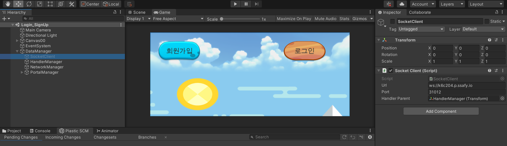
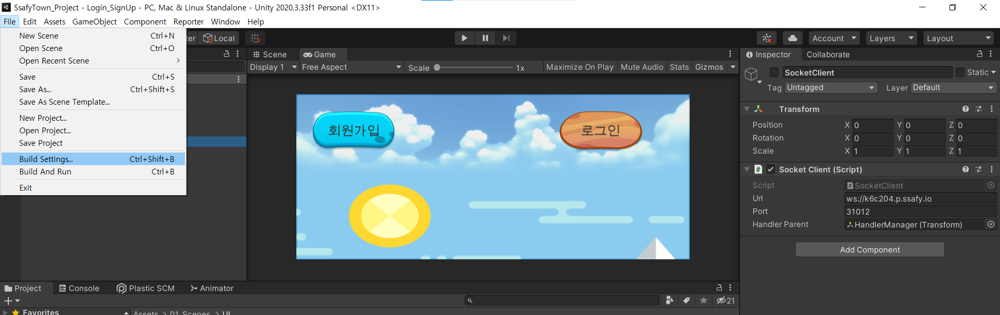
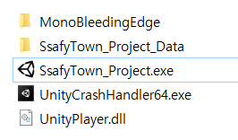

# SSAFYTOWN 배포 가이드

SSAFYTOWN은 유니티 클라이언트 기반 프로젝트입니다.

배포자는 아래 일련의 과정을 거쳐 배포를 진행하게 됩니다.

1.  게임에 필요한 필요한 서버(실시간 유저 연동 멀티플레이 서버, 로그인/회원가입/미니게임랭킹관련 API 서버 등)를 구동시킨다.
2. 유니티 클라이언트에서 서버에 잘 접속할 수 있도록 에디터 내부에서 url을 변경해준다.
3. url이 잘 적용된 유니티 클라이언트를 빌드한 후 해당 빌드 파일을 배포한다.
4. 사용자는 유니티 클라이언트 파일을 내려받고 유니티 프로그램을 실행한다.


### local device FE docker push

```
git clone [git repository]

cd S06P31C204/front/

npm run build
docker build -t [docker아이디]/[레포지토리]:tag명 .
docker push [docker아이디]/[레포지토리]:tag명
```


 ### EC2 배포 서버

#### node 설치

```
~$ sudo apt-get install -y curl

~$ curl -o- https://raw.githubusercontent.com/nvm-sh/nvm/v0.37.2/install.sh | bash 

~$ source ~/.bashrc

~$ nvm install v16.14.2

~$ nvm use v16.14.2
```

#### docker 설치

```
~$ sudo apt-get install docker

~$ sudo apt install docker
```

#### git 설치

```
~$ sudo apt-get install git

~$ sudo apt install git
```


#### 게임 서버 git clone 및 npm i

```
~$ git clone [git repository]

~$ cd S06P31C204/C204_Server/Dongil
~/S06P31C204/C204_Server/Dongil$ npm i
```

#### 서버를 백그라운드에서 실행하기 위해 pm2 설치

```
~/S06P31C204/C204_Server/Dongil$ npm install pm2 -g
프로젝트 내부가 아닌 글로벌 환경에 설치하기 위해 -g 명령어 사용
```

#### 서버 실행

```
~/S06P31C204/C204_Server/Dongil$ pm2 start server.js
~/S06P31C204/C204_Server/Dongil$ pm2 start app.js
~/S06P31C204/C204_Server/Dongil$ pm2 start router.js

anyway$ pm2 status
3개 서버 모두 잘 실행되고 있다면 실행 완료
```


#### FE 웹페이지 배포

```
~$ sudo docker pull [docker아이디]/[레포지토리]:tag명
~$ sudo docker run -dp 80:80 -dp 3000:3000 [docker아이디]/[레포지토리]:tag명
```


### Unity 클라이언트 설정



Assets/01_Scenes/UI 의 Login_SignUp scene에서 DataManager Object 하위 Object SocketClient 선택

우측 Inspector 탭에서 Url, Port를 현재 배포자가 구동시킨 서버와 맞게 설정합니다.



좌상단의 File, Build Settings...로 들어가서


Muiltitest를 제외한 모든 Scene을 체크해준 후 빌드합니다.



빌드된 경로의 SsafyTown_Project.exe 파일을 통해 클라이언트를 실행시킵니다.


빌드된 파일을 구글클라우드 등의 서비스를 이용하여 다운로드 받을 수 있도록 준비하고, 

FE 웹페이지 버튼과 다운로드 링크를 연결시켜서 유저가 클라이언트를 다운로드 받을 수 있도록 합니다.