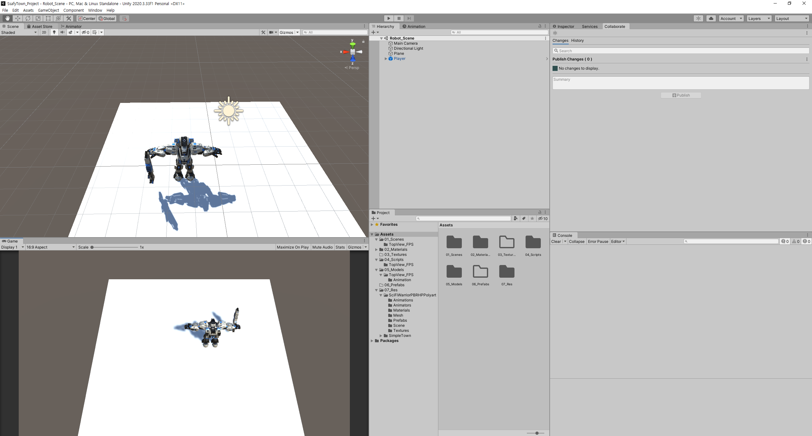

# 0425 TIL





### 주요기능 구현 :  마우스 포인터를 따라 로봇 시점 이동, 상하좌우 이동 구현

```c#
using System.Collections;
using System.Collections.Generic;
using UnityEngine;

[RequireComponent (typeof (PlayerController))]
public class Player : MonoBehaviour
{
    public float moveSpeed = 1.8f;
    PlayerController controller;
    Animator anim;
    bool runKeyDown;

    Camera viewCamera; // 마우스 포인터 생성을 위한 카메라 오브젝트 생성

    private void Awake()
    {
        anim = GetComponentInChildren<Animator>();
    }
    void Start()
    {
        controller = GetComponent<PlayerController>();
        viewCamera = Camera.main; //viewCamera에 메인카메라 지정
        moveSpeed = 2.5f;
    }

    // Update is called once per frame
    void Update()
    {
        Vector3 moveInput = new Vector3(Input.GetAxis("Horizontal"), 0, Input.GetAxis("Vertical"));
        Vector3 moveVelocity = moveInput.normalized * moveSpeed * (runKeyDown ? 1.8f : 1f);
        controller.Move(moveVelocity);


        Ray ray = viewCamera.ScreenPointToRay(Input.mousePosition); //카메라로부터 스크린으로 이어지는 ray 발사
        Plane groundPlane = new Plane(Vector3.up, Vector3.zero);
        float rayDistance;

        if (groundPlane.Raycast(ray,out rayDistance))
        {
            Vector3 point = ray.GetPoint(rayDistance) + new Vector3(0, 1, 0);
            Debug.DrawLine(ray.origin, point, Color.red); //Debug로실제 붉은 선 확인
            controller.LookAt(point);
        }

        runKeyDown = Input.GetButton("Run");
        anim.SetBool("isWalkFront", moveInput != Vector3.zero);
        anim.SetBool("isRun", runKeyDown);

    }
}

```

```c#
using System.Collections;
using System.Collections.Generic;
using UnityEngine;

public class PlayerController : MonoBehaviour
{
    Rigidbody myRigidbody;
    Vector3 velocity;
    // Start is called before the first frame update
    void Start()
    {
        myRigidbody = GetComponent<Rigidbody>();   
    }
    public void Move(Vector3 _velocity)
    {
        velocity = _velocity;
    }

    public void FixedUpdate()
    {
        myRigidbody.MovePosition(myRigidbody.position + velocity * Time.deltaTime);
    }

    public void LookAt(Vector3 lookPoint)
    {
        Vector3 heightCorrectedPoint = new Vector3(lookPoint.x, transform.position.y, lookPoint.z);
        transform.LookAt(heightCorrectedPoint);

    }
}

```


